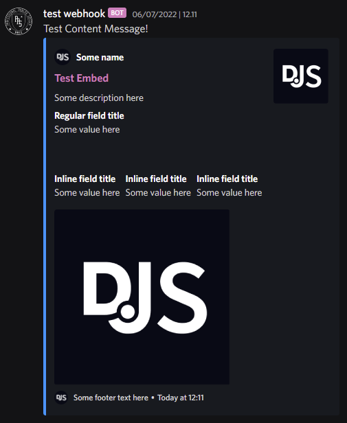

## About
rWebhook is a roblox to discord Webhook wrapper emulating methods of discord.js

- Ease of use
- Built in rate limiting
- Supports different proxies
- Object-oriented

## Methods
```
rWebhook(Url) -- Returns a 'rWebhook' object
		
rWebhook.MessageEmbed() -- Returns an 'Embed' object

Embed.
- setTitle(string)
- setDescription(string)
- setURL(url)
- setAuthor({name = string, value = string, inline = boolean})
- setFooter({text = string, iconURL = url});
- addFields({
  { name = string, value = string, inline = boolean },
  { name = string, value = string, inline = boolean },
  ...
})
- addField(name [string], value [string], inline [boolean])
- setColor(color) -- Color3, Hex Or Number
- setThumbnail(imageUrl)
- setImage(imageUrl)
- setTimestamp()
```

## Example usage
```lua
local rWebhook = require(rWebhook.Module.Location)("https://discord.com/api/webhooks/xxxxxxxxxxxx/xxxxxxxxxxxx")
		
local Embed = rWebhook.MessageEmbed()
  .setColor('#0099ff')
  .setTitle('Test Embed')
  .setURL('https://discord.js.org/')
  .setAuthor({ name = 'Some name', iconURL = 'https://i.imgur.com/AfFp7pu.png', url = 'https://discord.js.org' })
  .setDescription('Some description here')
  .setThumbnail('https://i.imgur.com/AfFp7pu.png')
  .addFields({
    { name = 'Regular field title', value = 'Some value here' },
    { name = "\u{200B}", value = "\u{200B}" },
    { name = 'Inline field title', value = 'Some value here', inline = true },
    { name = 'Inline field title', value = 'Some value here', inline = true },
  })
  .addField('Inline field title', 'Some value here', true)
  .setImage('https://i.imgur.com/AfFp7pu.png')
  .setTimestamp()
  .setFooter({ text = 'Some footer text here', iconURL = 'https://i.imgur.com/AfFp7pu.png' });

local Success, Response = rWebhook:Send({content = "This is additional text!", embeds = {Embed}})
```
<p>
  <a href=""></a>
</p>

## Links
- [Discord.js guide](https://discordjs.guide/popular-topics/embeds.html#embed-preview)
- [Discord API documentation](https://discord.com/developers/docs/resources/channel#embed-object-embed-limits)
- [GitHub](https://github.com/OssieNomae/rWebhook)
